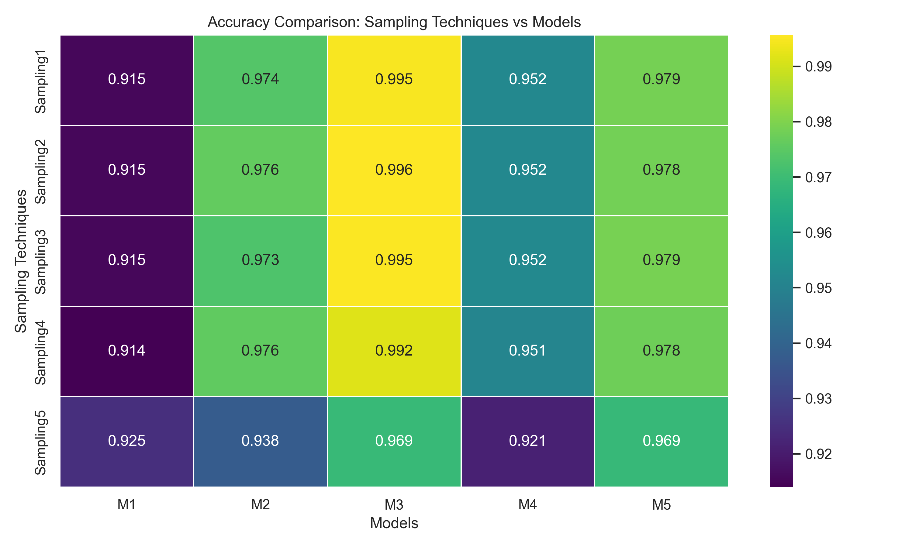
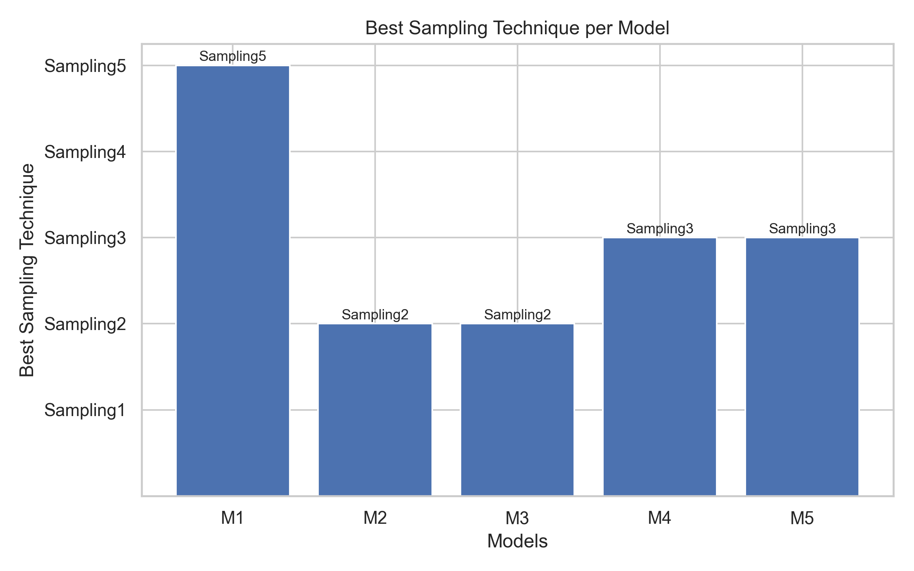

# Sampling Techniques on Imbalanced Credit Card Dataset

## Objective

The objective of this assignment is to analyze the impact of different sampling techniques on the performance of machine learning models when dealing with a highly imbalanced dataset. The study focuses on how balancing strategies influence classification accuracy.

---

## Dataset Description

The dataset used is a credit card transaction dataset containing a highly imbalanced target variable `Class`, where:

- `0` represents a normal transaction
- `1` represents a fraudulent transaction

Due to extreme class imbalance, direct training of machine learning models leads to biased predictions.

---

## Dataset Balancing

To convert the dataset into a balanced class dataset, **SMOTE (Synthetic Minority Over-sampling Technique)** was applied. This method synthetically generates minority class samples, ensuring equal representation of both classes while preserving underlying data patterns.

---

## Sampling Strategy

Five different sampling techniques were applied to the training data:

- **Sampling1:** Random Under Sampling
- **Sampling2:** Random Over Sampling
- **Sampling3:** SMOTE
- **Sampling4:** Tomek Links
- **Sampling5:** SMOTE + ENN

To ensure robustness, five different train–test samples were created using different random seeds.

---

## Machine Learning Models

Five machine learning models were evaluated:

- **M1:** Logistic Regression
- **M2:** Decision Tree
- **M3:** Random Forest
- **M4:** K-Nearest Neighbors
- **M5:** Support Vector Machine

Feature scaling using `StandardScaler` was applied to improve model convergence and performance.

---

## Results

### Accuracy Comparison

The heatmap below shows the average accuracy achieved by each model across different sampling techniques:

**Key Observations:**

- Random Forest (M3) consistently achieved the highest accuracy across most sampling techniques.
- SMOTE-based methods provided stable and strong performance.
- SMOTEENN slightly reduced accuracy for some models due to aggressive noise removal.
- No single sampling technique was universally optimal for all models.

---

### Best Sampling Technique per Model

The following chart highlights which sampling technique yielded the highest accuracy for each model:

This directly answers the assignment requirement of identifying the most effective sampling technique per model.

---

## Repository Structure

---

## Conclusion

This assignment demonstrates that sampling techniques play a critical role in handling imbalanced datasets. The effectiveness of a sampling method depends heavily on the machine learning model used. Model-aware sampling selection leads to better performance and more reliable predictions.

All assignment objectives were successfully implemented and analyzed.
