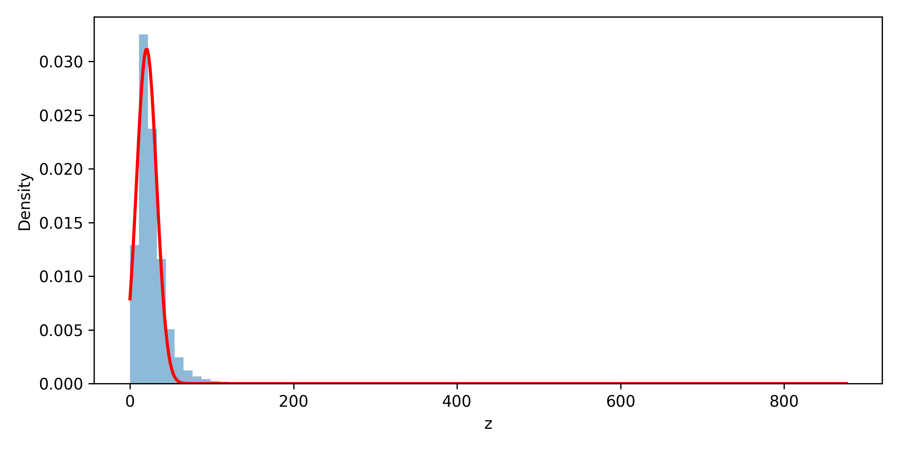

# Assignment – Learning Probability Density Function

This program learns the parameters of a probability density function using NO₂ data from the India Air Quality dataset.

The function we estimate is:

p(z) = c · exp(−λ (z − μ)²)

---

## What the program does

1. Takes your roll number and computes constants `a` and `b`

2. Reads NO₂ values from the dataset

3. Transforms data using:

   z = x + a sin(bx)

4. Fits the function to the data to estimate:

- lambda (λ)
- mu (μ)
- c

5. Saves a plot showing the fitted curve

---

## Files in folder

```
main.py
india-air-quality-data.csv
fitted.png
README.md
```

---

## Requirements

Install libraries:

pip install numpy pandas matplotlib scipy

---

## Dataset

Download from Kaggle:

https://www.kaggle.com/datasets/shrutibhargava94/india-air-quality-data

Put the CSV file in the same folder as `main.py`.

---

## How to run

1. Open `main.py`
2. Set your roll number and dataset file name
3. Run:

python main.py

---

## Output

Program prints estimated values of:

- lambda = 0.0033264974513405837
- mu = 20.332119932836612
- c = 0.031183102910158585



---

