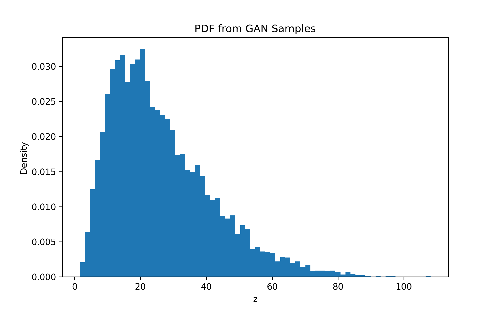

# Assignment - Learning Probability Density Functions using Data Only (GAN)

This program learns the probability density of transformed NO₂ data using a Generative Adversarial Network (GAN).

Dataset used: **India Air Quality Data (NO₂ concentration)**

---

## What the program does

1. Reads NO₂ values from dataset

2. Transforms data using roll-number based function

   z = x + aᵣ sin(bᵣ x)

3. Trains a GAN to learn the distribution of z

4. Generates many samples from generator

5. Estimates probability density using histogram

6. Saves the PDF plot

---

## Transformation Parameters

Roll Number: **102303748**

```
aᵣ = 0.5
bᵣ = 1.2
```

---

## Project Files

```
main.py
india-air-quality-data.csv
gan_pdf.png
README.md
```

The output image is saved in the **same folder** as the code.

---

## Requirements

Install libraries:

pip install tensorflow numpy pandas matplotlib

---

## Dataset

Download from:

https://www.kaggle.com/datasets/shrutibhargava94/india-air-quality-data

Place CSV file in the same folder as the Python script.

---

## How to Run

Open terminal in project folder and run:

python main.py

---

## Output Values (from program)

```
Real Mean = 25.798677
Generated Mean = 26.435135

Real Standard Deviation = 18.514837
Generated Standard Deviation = 15.4053335
```

---

## Output Plot

The following image shows the probability density estimated from GAN generated samples.



---

## Observations

- Generator learns main region of data distribution
- Training remains stable
- Generated distribution shows positive skewness
- Long tail behaviour is captured
- GAN successfully models the distribution of transformed data

---

## Conclusion

The GAN learned the probability density of the transformed variable directly from data samples without assuming any predefined distribution.
